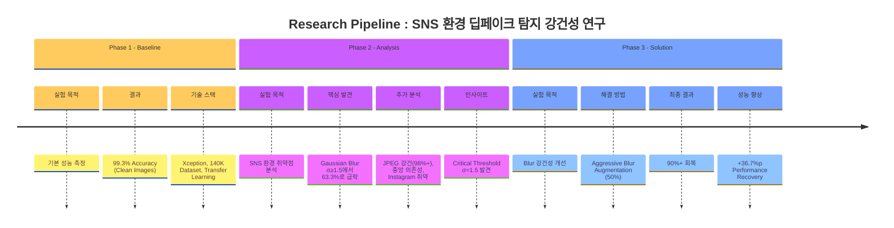

# Research Pipeline - Deepfake Detection in SNS Environment



```flowchart TD
    %% 전체 타이틀
    title[Research Pipeline : SNS 환경 딥페이크 탐지 강건성 연구]
    style title fill:none,stroke:none,font-size:22px,font-weight:bold

    %% Phase 1
    subgraph P1 [Phase 1 - Baseline]
        direction TB
        P1_H1(실험 목적) -.-> P1_C1[기본 성능 측정]
        P1_H2(결과) -.-> P1_C2["99.3% Accuracy<br/>(Clean Images)"]
        P1_H3(기술 스택) -.-> P1_C3["Xception, 140K Dataset,<br/>Transfer Learning"]
    end

    %% Phase 2
    subgraph P2 [Phase 2 - Analysis]
        direction TB
        P2_H1(실험 목적) -.-> P2_C1[SNS 환경 취약점 분석]
        P2_H2(핵심 발견) -.-> P2_C2["Gaussian Blur σ≥1.5에서<br/>63.3%로 급락"]
        P2_H3(추가 분석) -.-> P2_C3["JPEG 강건/중앙 의존성/<br/>Instagram 취약"]
        P2_H4(인사이트) -.-> P2_C4["Critical Threshold<br/>σ=1.5 발견"]
    end

    %% Phase 3
    subgraph P3 [Phase 3 - Solution]
        direction TB
        P3_H1(실험 목적) -.-> P3_C1[Blur 강건성 개선]
        P3_H2(해결 방법) -.-> P3_C2["Aggressive Blur<br/>Augmentation (50%)"]
        P3_H3(최종 결과) -.-> P3_C3["90%+ 회복"]
        P3_H4(성능 향상) -.-> P3_C4["+36.7%p Performance<br/>Recovery"]
    end

    %% Phase 간 연결 (선택 사항)
    P1 === P2 === P3

    %% 스타일 설정
    style P1 fill:#FFF3E0,stroke:#FFB74D
    style P2 fill:#F3E5F5,stroke:#BA68C8
    style P3 fill:#E3F2FD,stroke:#64B5F6
    
    classDef header fill:#fff,stroke-width:1px,font-weight:bold
    class P1_H1,P1_H2,P1_H3,P2_H1,P2_H2,P2_H3,P2_H4,P3_H1,P3_H2,P3_H3,P3_H4 header
