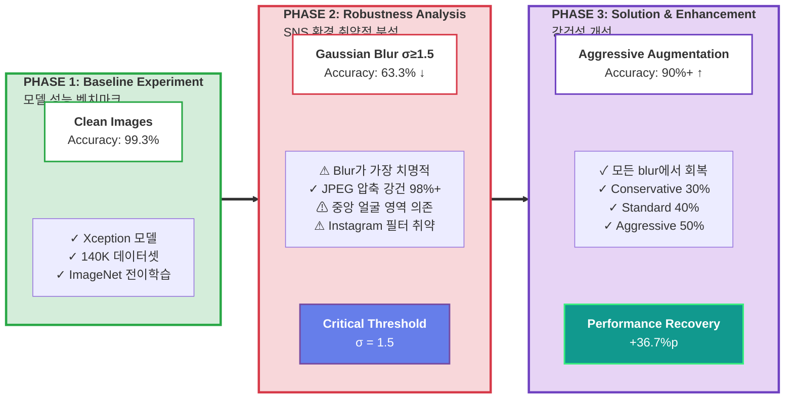
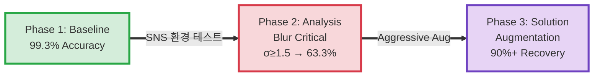
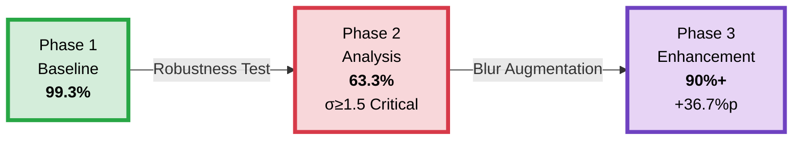

# Research Pipeline - Deepfake Detection

## 연구 파이프라인

## 사용 방법

위 코드를 GitHub README.md 파일에 그대로 복사해서 붙여넣으면 됩니다!

## 주요 특징

- ✅ **Phase 1**: Baseline 성능 (99.3%)
- ⚠️ **Phase 2**: 문제 발견 (σ≥1.5에서 63.3%로 급락)
- ✅ **Phase 3**: 해결책 적용 (90%+ 회복)

---

## Alternative: 더 간단한 버전

## 더 간결한 버전 (추천)

