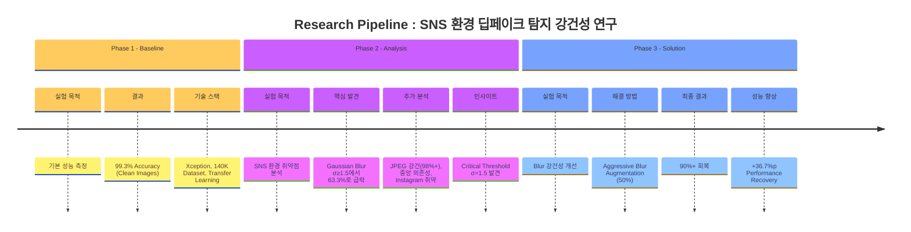
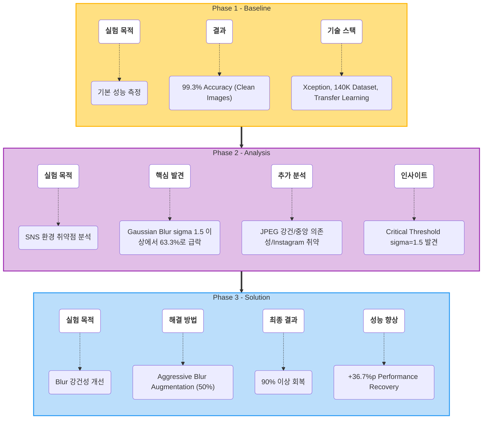

# Research Pipeline - Deepfake Detection in SNS Environment

```mermaid

%%{init: {'theme':'base', 'themeVariables': { 'fontSize':'18px'}}}%%


timeline

    title Research Pipeline : SNS 환경 딥페이크 탐지 강건성 연구

    

    section Phase 1 - Baseline

        실험 목적 : 기본 성능 측정

        결과 : 99.3% Accuracy (Clean Images)

        기술 스택 : Xception, 140K Dataset, Transfer Learning

    

    section Phase 2 - Analysis  

        실험 목적 : SNS 환경 취약점 분석

        핵심 발견 : Gaussian Blur σ≥1.5에서 63.3%로 급락

        추가 분석 : JPEG 강건(98%+), 중앙 의존성, Instagram 취약

        인사이트 : Critical Threshold σ=1.5 발견

    

    section Phase 3 - Solution

        실험 목적 : Blur 강건성 개선

        해결 방법 : Aggressive Blur Augmentation (50%)

        최종 결과 : 90%+ 회복

        성능 향상 : +36.7%p Performance Recovery

```

``` mermaid
flowchart TD
    %% 1. 전체 구조 선언 (이 줄이 반드시 첫 줄에 있어야 합니다)
    
    %% 2. 스타일 정의
    classDef yellow fill:#FFE082,stroke:#FFB300,stroke-width:2px;
    classDef purple fill:#E1BEE7,stroke:#9C27B0,stroke-width:2px;
    classDef blue fill:#BBDEFB,stroke:#2196F3,stroke-width:2px;
    classDef header font-weight:bold,fill:#fff;

    %% 3. Phase 1 - Baseline
    subgraph P1 ["Phase 1 - Baseline"]
        direction TB
        P1_H1("실험 목적") -.-> P1_C1("기본 성능 측정")
        P1_H2("결과") -.-> P1_C2("99.3% Accuracy (Clean Images)")
        P1_H3("기술 스택") -.-> P1_C3("Xception, 140K Dataset, Transfer Learning")
    end

    %% 4. Phase 2 - Analysis
    subgraph P2 ["Phase 2 - Analysis"]
        direction TB
        P2_H1("실험 목적") -.-> P2_C1("SNS 환경 취약점 분석")
        P2_H2("핵심 발견") -.-> P2_C2("Gaussian Blur sigma 1.5 이상에서 63.3%로 급락")
        P2_H3("추가 분석") -.-> P2_C3("JPEG 강건/중앙 의존성/Instagram 취약")
        P2_H4("인사이트") -.-> P2_C4("Critical Threshold sigma=1.5 발견")
    end

    %% 5. Phase 3 - Solution
    subgraph P3 ["Phase 3 - Solution"]
        direction TB
        P3_H1("실험 목적") -.-> P3_C1("Blur 강건성 개선")
        P3_H2("해결 방법") -.-> P3_C2("Aggressive Blur Augmentation (50%)")
        P3_H3("최종 결과") -.-> P3_C3("90% 이상 회복")
        P3_H4("성능 향상") -.-> P3_C4("+36.7%p Performance Recovery")
    end

    %% 6. 상호 연결 및 스타일 적용
    P1 ==> P2 ==> P3
    
    class P1 yellow;
    class P2 purple;
    class P3 blue;
    class P1_H1,P1_H2,P1_H3,P2_H1,P2_H2,P2_H3,P2_H4,P3_H1,P3_H2,P3_H3,P3_H4 header;
```
