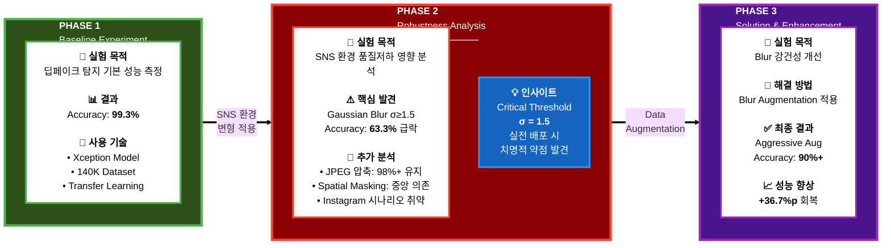
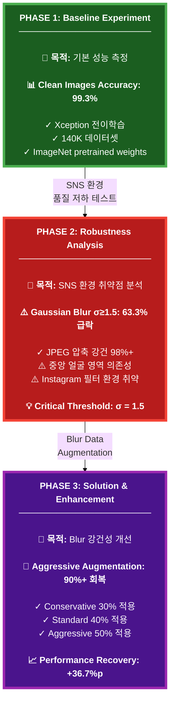
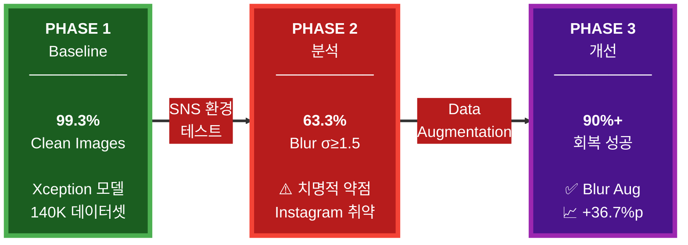
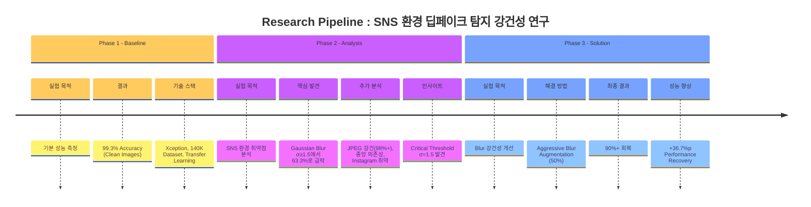
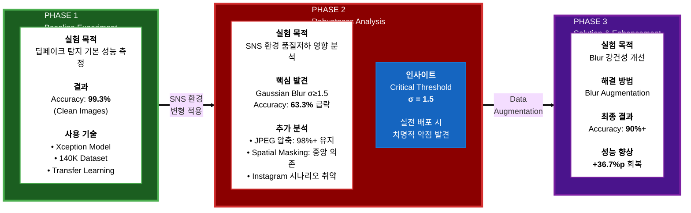
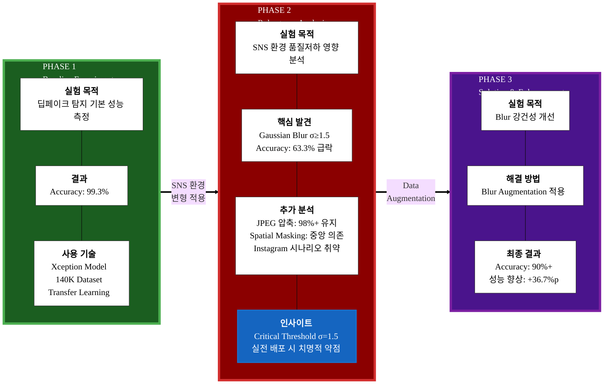
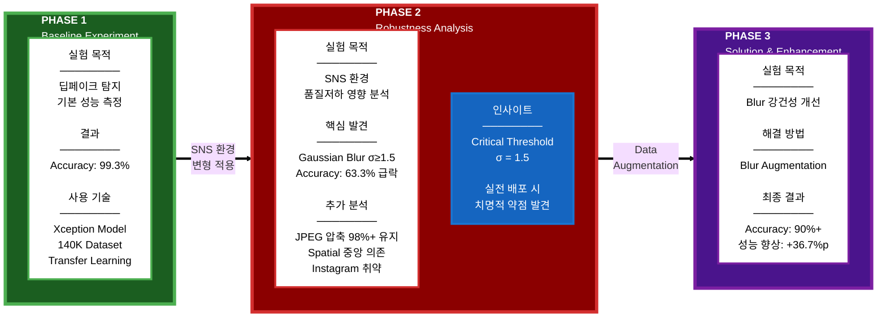

# Research Pipeline - Deepfake Detection in SNS Environment

---

## 대안 1: 더 깔끔한 세로 레이아웃

---

## 대안 2: 가장 심플하고 강렬한 버전 (추천!)

---

## 대안 3: 타임라인 스타일 (매우 명확)

# Research Pipeline - Deepfake Detection in SNS Environment

---

## 더 심플한 버전 (추천!)

---

## 가장 깔끔한 버전 (최종 추천!)

