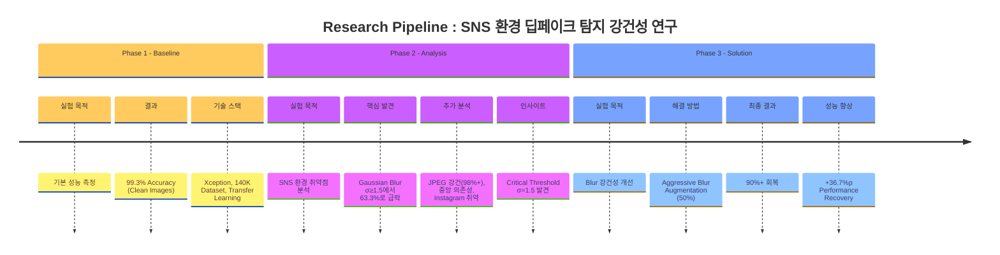
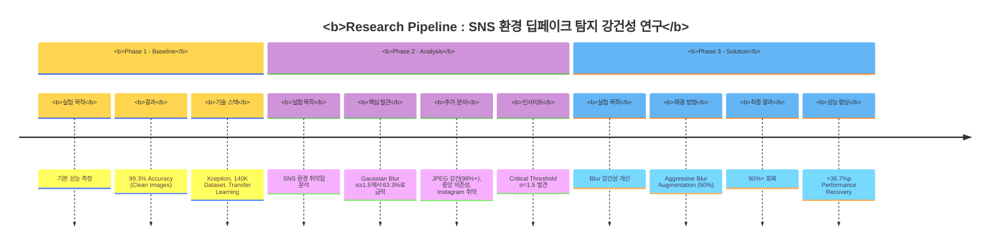
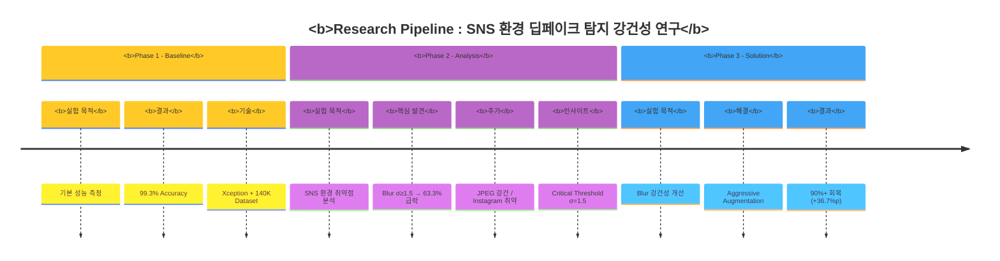
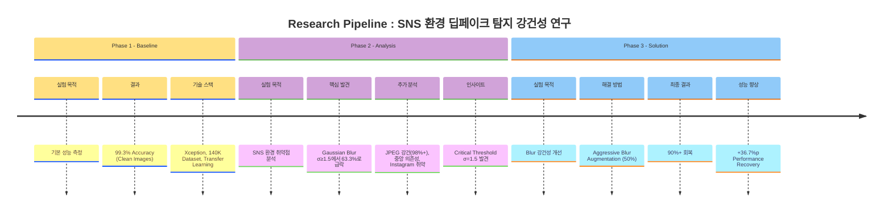

# Research Pipeline - Deepfake Detection in SNS Environment

# Research Pipeline - Deepfake Detection in SNS Environment

---

## 대안: 더 간결한 버전

---

## 대안 2: 색상만 조정한 원본

---

## 설명

### 적용한 수정사항:
1. **Bold 추가**: `<b>실험 목적</b>`, `<b>결과</b>` 등 라벨에 볼드 적용
2. **보라색 연하게**: 
   - 원본: 진한 보라 → 수정: `#ce93d8` (연한 보라/라벤더)
   - 대안에서는 `#ba68c8`, `#d1a3d9` 등 다양한 옵션 제공
3. **색상 조합**:
   - Phase 1: 노란색 (`#ffd54f`, `#ffca28`, `#ffe082`)
   - Phase 2: 연한 보라 (`#ce93d8`, `#ba68c8`, `#d1a3d9`)
   - Phase 3: 파란색 (`#64b5f6`, `#42a5f5`, `#90caf9`)

### 주의사항:
Timeline 스타일의 경우 Mermaid 자체 제약으로 인해 **간격과 화살표는 기본 렌더링 방식**을 따릅니다. 안타깝게도 Mermaid timeline에서는 이를 직접 제어할 수 없습니다. 

만약 더 세밀한 커스터마이징이 필요하다면, 다른 다이어그램 타입(flowchart, graph)을 사용하거나 HTML/이미지로 만드는 것을 추천드립니다.

어떤 색상 조합이 가장 마음에 드시나요?

